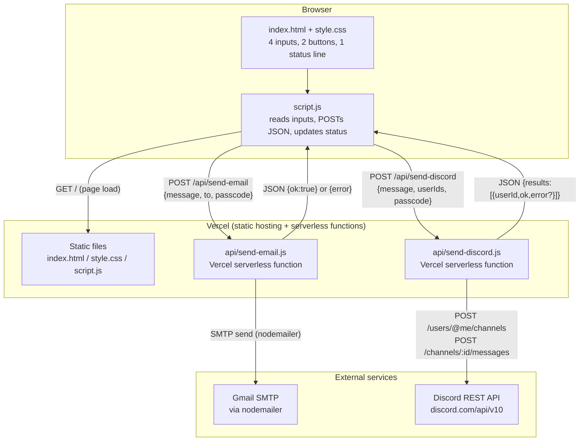

# ARCHITECTURE.md — Technical Architecture Reference

## System overview

Click to Send is a single-page static frontend plus two independent Vercel
serverless functions. There is no framework, no build step, and no
database. All state is either typed into the page per-visit or read from
Vercel environment variables at request time — nothing persists between
requests.

## Architecture diagram

## Frontend structure

- **No routing.** A single page, `index.html`, at the repo root — served
  by Vercel's static hosting. No client-side router, no other pages.
- **No framework.** Vanilla DOM APIs only (`document.getElementById`,
  `addEventListener`, `fetch`). `script.js` is loaded via a plain
  `<script src="/script.js">` tag at the end of `<body>` (no `type="module"`
  on the tag itself, though `package.json` sets `"type": "module"` for
  Node-side files — the browser script uses top-level `const`s and normal
  function/event-listener syntax, no `import`/`export`).
- **State management:** None beyond the DOM itself. Every value
  (`message`, `to`, `discord-ids`, `passcode`) is read fresh from its
  input element at click time; nothing is cached in a JS variable across
  interactions, and nothing is persisted to `localStorage`/cookies.

## Backend structure (`api/`)

- **Runtime:** Vercel serverless functions, Node.js. Each file's default
  export is a `(req, res) => {...}` handler — the plain Vercel Functions
  signature (not a Next.js `NextApiRequest`/`NextApiResponse` or App
  Router `Request`/`Response` — there is no Next.js dependency anywhere in
  `package.json`).
- **Routing:** Filesystem-based. `api/send-email.js` → `POST
  /api/send-email`; `api/send-discord.js` → `POST /api/send-discord`. No
  routing config file, no `vercel.json` found in the repo — this is
  Vercel's zero-config default behavior for anything under `api/`.
- **Two files, no shared module.** Each handler independently reads
  `process.env`, validates its own inputs, and performs its own external
  call. There is no `api/_lib/` or similar shared helper — see
  `CLAUDE.md`/`TASKS.md` for the (low-priority) note about the small
  amount of duplicated validation logic between the two.

## Request lifecycle — `POST /api/send-email`

1. Browser: user fills recipient/message/passcode, clicks "Send Email".
2. `script.js`'s `emailBtn` click handler does client-side presence checks
   (message/recipient/passcode all non-empty) — purely a UX convenience,
   not a security boundary.
3. `post("/api/send-email", { message, to, passcode })` sends a `fetch`
   POST with `Content-Type: application/json`.
4. `api/send-email.js` handler:
   a. Rejects non-POST with 405.
   b. Reads `GMAIL_USER`, `GMAIL_APP_PASSWORD`, `SITE_PASSCODE` from
      `process.env`; if any is missing, returns 500
      `{error:"Server is not configured"}`.
   c. Compares `passcode` to `SITE_PASSCODE`; on mismatch/missing, returns
      401 `{error:"Invalid access code"}`.
   d. Validates `message` is a non-empty trimmed string; else 400.
   e. Validates `to` matches `EMAIL_RE`; else 400.
   f. Creates a `nodemailer` Gmail transport and calls `sendMail({from:
      GMAIL_USER, to, subject:"New message from Click to Send", text:
      message})` inside a `try/catch`.
   g. On success: 200 `{ok:true}`. On thrown error: 500 `{error:"Failed
      to send email"}` (the underlying error's message/stack is not
      returned to the client — only logged implicitly wherever Vercel
      captures function stderr/stdout, not inspected in this repo).
5. `script.js` awaits the response; on non-OK, throws using the response's
   `error` field; the click handler catches it and writes `Failed to send
   email: <message>` into the status line. On success, writes "Email
   sent."

## Request lifecycle — `POST /api/send-discord`

1. Browser: user fills comma-separated Discord IDs/message/passcode,
   clicks "Send Discord DM".
2. `script.js` splits the IDs field on `,`, trims each, filters empties,
   does the same message/passcode presence checks as the email path.
3. `post("/api/send-discord", { message, userIds, passcode })`.
4. `api/send-discord.js` handler:
   a. Rejects non-POST with 405.
   b. Reads `DISCORD_BOT_TOKEN`, `SITE_PASSCODE`; if either is missing,
      500 `{error:"Discord is not configured on the server"}`.
   c. Passcode check → 401 on mismatch, same as the email path.
   d. Validates `message` non-empty string; else 400.
   e. Validates `userIds` is a non-empty array; else 400.
   f. Deduplicates via `new Set(userIds.map(id => String(id).trim()))`.
   g. Caps at `MAX_RECIPIENTS = 20`; else 400.
   h. Validates every ID matches `SNOWFLAKE_RE` (`^\d{15,20}$`); else 400
      (all-or-nothing — if any one ID is malformed, the whole request is
      rejected before any DM is attempted).
   i. Sequentially (`for...of`, not `Promise.all`) calls `sendDm()` for
      each ID: `POST /users/@me/channels` with `{recipient_id: userId}`
      to open/get a DM channel, then `POST
      /channels/:channelId/messages` with `{content: message}`. Each
      call's non-OK response throws (`could not open DM channel (status)`
      or `could not send message (status)`), caught per-recipient so one
      failure doesn't stop the loop.
   j. Returns 200 with `{results: [{userId, ok, error?}, ...]}` — always
      200 at the HTTP level even if every individual DM failed; per-item
      success/failure is only visible inside the `results` array.
5. `script.js` computes `failed = results.filter(r => !r.ok)` and writes a
   summary like `Sent to 3/5. Failed: 123, 456` or `Sent to 5
   recipient(s).` into the status line.

## Data flow

No persistent data store anywhere. Per request: browser input → JSON body
→ handler validation → external API call (Gmail SMTP or Discord REST) →
JSON response → status line text. Nothing is written to disk, a database,
or any cache at any point.

## Authentication flow

There is no user authentication. The only gate is the shared
`SITE_PASSCODE` string, typed into the page's "Access code" field and
compared server-side in both handlers. It is not hashed, not rate-limited,
and not tied to any identity — anyone who knows the passcode can use
either endpoint fully. See `SECURITY.md`.

## Authorization flow

None beyond the passcode check above — there are no roles, no per-user
permissions, no ownership concept.

## Database access flow

N/A — no database exists. See `DATABASE.md`.

## External API / integration flow

- **Gmail SMTP** (`api/send-email.js`): `nodemailer.createTransport({
  service:"gmail", auth:{user:GMAIL_USER, pass:GMAIL_APP_PASSWORD}})`,
  then `transporter.sendMail(...)`. Uses Gmail's app-password SMTP path,
  not OAuth2.
- **Discord REST API** (`api/send-discord.js`): two direct `fetch` calls
  per recipient against `https://discord.com/api/v10/...`, authenticated
  via `Authorization: Bot <DISCORD_BOT_TOKEN>` header. No Discord SDK
  dependency — hand-rolled HTTP calls.

## Real-time communication

None. Every interaction is a single request/response `fetch` call; no
WebSocket, no polling, no server-sent events.

## Background / scheduled jobs

None. No cron config, no queue, no retry mechanism — each click sends
exactly once, per the README's own stated design ("there's no queue,
retry, or repeat-send built in").

## Caching

None configured anywhere in the repo — no cache headers, no CDN
configuration beyond Vercel's own static-asset defaults for
`index.html`/`style.css`/`script.js`.

## Error handling

- **Server-side:** every handler wraps its actual external call in
  `try/catch` and returns a generic `{error: "..."}` JSON body with an
  appropriate HTTP status (400/401/405/500). No stack traces or internal
  error details are ever sent to the client.
- **Client-side:** `script.js`'s `post()` helper throws
  `new Error(data.error || "Request failed")` on any non-OK response; both
  button click handlers wrap their `await post(...)` calls in `try/catch`
  and write the error message into `#status`. Buttons are re-enabled in a
  `finally` block regardless of outcome.
- **No global error boundary** (not applicable — there's no SPA framework)
  and no operational error-reporting/monitoring service (e.g. Sentry) is
  configured anywhere in the repo.

## Logging

No explicit logging code exists in `index.html`/`script.js`/`api/*.js`
(confirmed via a repo-wide grep for `console.log` — zero matches outside
`node_modules`). Whatever Vercel captures automatically from serverless
function `stdout`/`stderr` (e.g. uncaught exceptions) is platform-level
behavior, not something configured in this repo.

## Deployment architecture

Single deploy target: Vercel, serving both the static files and the two
`api/` serverless functions from one project. See `DEPLOYMENT.md` for the
full detail, including the confirmed absence of GitHub auto-deploy for
this project (deploys are manual `npx vercel --prod` invocations).

## Scaling considerations

Not a concern at this project's scale (a personal utility). Each serverless
function invocation is stateless and independent; Vercel scales function
concurrency automatically. The one built-in limit is `MAX_RECIPIENTS = 20`
in `api/send-discord.js`, which is a deliberate product cap, not a
technical scaling limit.

## Security boundaries

See `SECURITY.md` for the full review. The key boundary: **the shared
`SITE_PASSCODE` is the only thing separating "anyone who finds the public
URL" from "can send email/Discord DMs through this account."** It is
compared with `!==` (not a constant-time comparison), sent in plaintext
JSON over HTTPS (not hashed client-side), and has no rate limiting, no
lockout, and no audit log of attempts. This is explicitly acknowledged as
a known limitation in the existing `README.md` ("good enough to keep
random visitors out, not a substitute for real auth").

## Major architectural risks

1. **No rate limiting on either endpoint** — a leaked or guessed passcode
   allows unlimited sends until the passcode is rotated. See
   `SECURITY.md`.
2. **No confirmation that the deployed build matches `HEAD`** — see
   `PROJECT_STATE.md`'s "Needs confirmation" note. Low risk given the repo
   is small and the last commit was a trivial favicon addition, but worth
   checking before assuming prod behavior matches the current source.
3. **Duplicated validation code** between the two `api/*.js` handlers —
   not a bug today, but a future third endpoint copying the same pattern a
   third time would be a sign to extract a shared helper.
